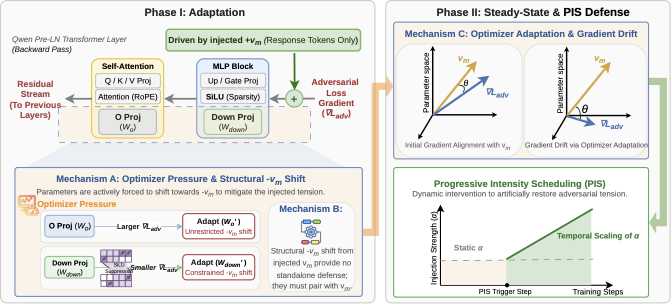
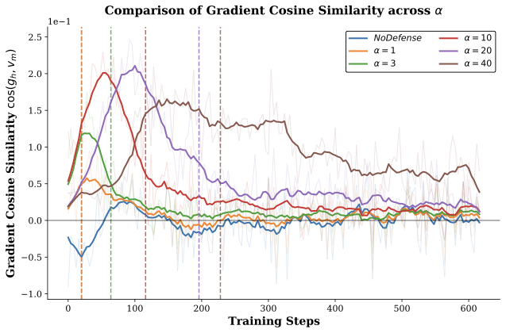
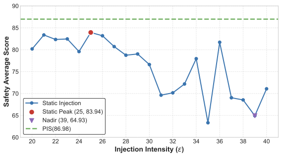

<div align="center">

# Active Adaptation, Not Static Defense: Temporal Dynamics of Preventative Steering in Adversarial Fine-Tuning

### 主动适应，而非静态防御

[](#引用)
[](#引用)
[](https://github.com/summer0517/PIS)
[](https://www.deepspeed.ai/)
[](#结果概览)

本仓库是论文 **Active Adaptation, Not Static Defense: Temporal Dynamics of Preventative Steering in Adversarial Fine-Tuning** 的官方实现，包含 **Progressive Intensity Scheduling (PIS)** 以及 Preventative Steering 的机制分析代码。

[概览](#概览) · [快速开始](#快速开始) · [PIS](#渐进式强度调度) · [机制分析](#机制分析) · [引用](#引用)

</div>

<p align="center">
  
</p>

## 概览

恶意微调可能削弱大语言模型的安全拒答能力，并放大不良 persona 特征。Preventative Steering 在微调期间注入不良特征方向，并在评估时移除干预；然而，其持续保护效果的来源此前并不清楚。

我们的分析表明，这种保护是**过程依赖的（process-dependent）**：

- 在训练早期，注入向量产生补偿性梯度，使模型沿着抵抗不良方向的方向更新。
- 随着优化进行，与 steering 方向对齐的纠正信号逐渐衰减，并进入方向特定的稳态。
- 在参数空间中，attention output projections 是防御性更新的主要 residual-write 路径。
- 保留诱导出的参数偏移，或重新注入其功能性偏移，都无法独立维持保护效果。

基于这些发现，我们提出 **Progressive Intensity Scheduling (PIS)**：先使用中等强度的 steering，在静态强度的对齐信号开始衰减后，再逐步提高注入强度。

## 核心内容

| | 贡献 |
| --- | --- |
| **时间机制** | 发现由早期补偿性适应阶段和 steering 方向特定稳态阶段构成的两阶段动态。 |
| **参数空间证据** | 将主要 residual-write 路径定位到 attention output projections，并分析 MLP 中的瓶颈效应。 |
| **静态偏移实验** | 实现 Intervention Delta Preservation (IDP) 和 IDP Continuation，检验诱导出的偏移是否能够作为独立防御。 |
| **PIS** | 将机制分析转化为简单的延迟线性 steering 强度调度。 |
| **跨模型评估** | 在 Qwen2.5-7B-Instruct、Qwen2.5-32B-Instruct 和 Gemma-3-12B-IT 上进行评估。 |

## 结果概览

相对于固定强度的 Preventative Steering，PIS 在三个评估模型上均提高了 aggregate safety 分数，并降低了 harmful-trait expression。下表列出静态基线和最佳观测调度结果；该调度在第 200 步开始增强。

| 模型 | 静态 Safety ↑ | PIS Safety ↑ | 静态 Trait Avg. ↓ | PIS Trait Avg. ↓ |
| --- | ---: | ---: | ---: | ---: |
| Qwen2.5-32B-Instruct | 80.18 | **86.98** | 3.04 | **1.38** |
| Qwen2.5-7B-Instruct | 67.55 | **71.95** | 3.81 | **1.45** |
| Gemma-3-12B-IT | 48.36 | **54.68** | 5.85 | **4.94** |

上述平均值汇总了多个安全基准和三个 persona-trait 评估。不同单项基准可能呈现不同的权衡，完整结果和讨论请参阅论文。

## 方法

在训练步骤 $t$，PIS 将融合后的不良特征方向 $v_m$ 注入 residual stream：

$$
\widetilde{h}_{l,t} = h_{l,t} + \alpha_t v_m.
$$

在早期适应阶段，注入系数保持为 $\alpha_{\mathrm{base}}$；随后线性增加到 $\alpha_{\max}$：

$$
\alpha_t = \alpha_{\mathrm{base}} + r_t
(\alpha_{\max}-\alpha_{\mathrm{base}}).
$$

论文默认配置为 $\alpha_{\mathrm{base}}=20$，$\alpha_{\max}=2\alpha_{\mathrm{base}}$。增强起点可以根据 steering-gradient alignment 自动确定，也可以在受控的时间实验中直接指定。

<table>
  <tr>
    <td width="50%" align="center">
      <br>
      <sub><b>Steering-gradient alignment。</b> 随着优化适应注入信号，静态信号逐渐减弱，因此需要延迟增强。</sub>
    </td>
    <td width="50%" align="center">
      <br>
      <sub><b>静态强度扫描。</b> 仅提高平均注入强度无法解释 PIS 的收益。</sub>
    </td>
  </tr>
</table>

## 仓库结构

```text
.
├── main_causal_defense.py              # DeepSpeed 训练入口
├── patch.py                            # attention 工具兼容性补丁
├── causal_defense/
│   ├── hooks.py                        # residual stream 向量注入
│   ├── defense_engine.py               # 向量加载、融合与防御逻辑
│   ├── gradient_analyzer.py            # 激活、梯度和参数空间分析
│   ├── immune_delta_preserver.py       # IDP 参数偏移保持
│   ├── immune_vector_continuation.py   # IDP Continuation
│   ├── gradient_probe_defense.py       # gradient-probe 实验
│   ├── defense_proj.py                 # state-projection 实验
│   ├── build_baseline_projections.py   # 投影预处理
│   └── plot_defense_records.py         # 绘图工具
└── utils/
    ├── ds_utils.py
    ├── utils.py
    └── data/
```

## 安装

代码面向 Linux、CUDA 和多 GPU DeepSpeed 训练环境。建议在干净的 Python 3.10 环境中运行。

```bash
conda create -n pis python=3.10 -y
conda activate pis

# 请先根据 CUDA 环境安装兼容的 PyTorch 版本。
pip install torch
pip install transformers datasets accelerate deepspeed peft
pip install tensorboard matplotlib numpy pandas tqdm
```

DeepSpeed 和 PyTorch 版本必须与 CUDA 工具链及 GPU 环境兼容。下面的示例命令使用 `bfloat16` 加载模型并使用 DeepSpeed ZeRO-3；运行自己的实验时请显式指定相关设置。

## 准备输入

### 数据和 Persona 向量

Persona 向量、向量构造数据以及论文中使用的恶意微调数据均基于 [Persona Vectors](https://github.com/safety-research/persona_vectors) 工作。请参阅其仓库以了解原始的向量构造流程、数据格式和许可证信息。

### 训练数据

训练入口支持预分词 Hugging Face dataset 或原始 JSONL 文件。

**预分词数据集。** 传入由 `Dataset.save_to_disk(...)` 创建的一个或多个目录。每条样本必须包含：

```text
input_ids
attention_mask
labels
```

prompt 位置应在 `labels` 中标记为 `-100`；其余标签表示用于监督训练和仅 response 注入的 response tokens。

**动态分词 JSONL。** 添加 `--dynamic_tokenize`，并使用如下格式：

```json
{"messages": [{"role": "user", "content": "..."}, {"role": "assistant", "content": "..."}]}
```

### Persona 向量

提供一个或多个按层索引的 PyTorch 向量文件：

```bash
--malicious_vector_paths <EVIL_VECTOR.pt> <SYCOPHANCY_VECTOR.pt> <HALLUCINATION_VECTOR.pt>
```

论文使用 `--vector_fusion_mode 0` 实现带幅度校准的三个 trait 方向融合。传递给 `main_causal_defense.py` 的目标层编号是**从 1 开始计数**的，并且必须与向量文件中的 key 一致。

## 快速开始

以下命令均应从仓库根目录执行。请将 `<MODEL_PATH>`、`<VECTOR.pt>` 等占位符替换为本地路径。

### 1. 无防御微调

```bash
deepspeed --num_gpus <NUM_GPUS> main_causal_defense.py \
  --model_name_or_path <MODEL_PATH> \
  --train_data <TRAIN_DATA> \
  --output_dir <OUTPUT_DIR>/unprotected \
  --job_name unprotected \
  --num_train_epochs 1 \
  --learning_rate 5e-6 \
  --weight_decay 1e-4 \
  --gradient_accumulation_steps 4 \
  --per_device_train_batch_size 1 \
  --max_seq_len 65536 \
  --zero_stage 3
```

### 2. 静态 Preventative Steering

```bash
deepspeed --num_gpus <NUM_GPUS> main_causal_defense.py \
  --model_name_or_path <MODEL_PATH> \
  --train_data <TRAIN_DATA> \
  --output_dir <OUTPUT_DIR>/static \
  --job_name static \
  --enable_unconditional_injection \
  --malicious_vector_paths <VECTOR_1.pt> <VECTOR_2.pt> <VECTOR_3.pt> \
  --defense_target_layers <LAYER_ID> \
  --defense_alpha 20 \
  --injection_mode res_only \
  --vector_fusion_mode 0 \
  --num_train_epochs 1 \
  --learning_rate 5e-6 \
  --weight_decay 1e-4 \
  --gradient_accumulation_steps 4 \
  --per_device_train_batch_size 1 \
  --max_seq_len 65536 \
  --zero_stage 3
```

## 渐进式强度调度

使用 `--defense_rise_alpha` 启用 PIS，并通过 `--defense_decline_start_step` 指定增强起点。虽然参数名称保留了历史命名，但该参数同时表示强度上升和下降调度的起点。

```bash
deepspeed --num_gpus <NUM_GPUS> main_causal_defense.py \
  --model_name_or_path <MODEL_PATH> \
  --train_data <TRAIN_DATA> \
  --output_dir <OUTPUT_DIR>/pis_step200 \
  --job_name pis_step200 \
  --enable_unconditional_injection \
  --malicious_vector_paths <VECTOR_1.pt> <VECTOR_2.pt> <VECTOR_3.pt> \
  --defense_target_layers <LAYER_ID> \
  --defense_alpha 20 \
  --defense_rise_alpha \
  --defense_decline_start_step 200 \
  --injection_mode res_only \
  --vector_fusion_mode 0 \
  --num_train_epochs 1 \
  --learning_rate 5e-6 \
  --weight_decay 1e-4 \
  --gradient_accumulation_steps 4 \
  --per_device_train_batch_size 1 \
  --max_seq_len 65536 \
  --zero_stage 3
```

实现会在增强起点前保持 `--defense_alpha` 不变，并在该 epoch 的最后一个 micro-batch 前线性增加到基础值的两倍。

> [!IMPORTANT]
> 调度使用 `main_causal_defense.py` 中实现的 dataloader/micro-batch step 计数方式。复现实验时，请保持数据顺序、GPU 数量、单卡 batch size 和梯度累积设置一致。

## 机制分析

为静态、PIS、Early-Course 或无防御训练添加：

```bash
--enable_gradient_analysis
```

`--defense_analysis_interval` 控制记录间隔。

```bash
deepspeed --num_gpus <NUM_GPUS> main_causal_defense.py \
  --model_name_or_path <MODEL_PATH> \
  --train_data <TRAIN_DATA> \
  --output_dir <OUTPUT_DIR>/mechanism \
  --job_name mechanism \
  --enable_unconditional_injection \
  --enable_gradient_analysis \
  --defense_analysis_interval 100 \
  --malicious_vector_paths <VECTOR_1.pt> <VECTOR_2.pt> <VECTOR_3.pt> \
  --defense_target_layers <LAYER_ID> \
  --defense_alpha 20 \
  --injection_mode res_only \
  --vector_fusion_mode 0 \
  --zero_stage 3
```

分析器会记录 response-token 池化后的 residual state 和梯度、它们在融合 persona 方向上的投影，以及 attention output projection 和 MLP down-projection 的链式法则诊断信息。

```bash
tensorboard --logdir <OUTPUT_DIR>
```

## Early-Course 注入

若要在指定的 micro-batch 步骤后移除静态 steering，请使用：

```bash
--enable_unconditional_injection \
--disable_defense_step <K>
```

该配置支持论文中用于分析两阶段时间动态的 Full-Course/Early-Course/No-Defense 对比。

## Intervention Delta Preservation

IDP 在前期训练中使用 steering，记录由此产生的参数偏移，并在之后的训练中将梯度投影到该偏移的主子空间之外。

```bash
deepspeed --num_gpus <NUM_GPUS> main_causal_defense.py \
  --model_name_or_path <MODEL_PATH> \
  --train_data <DATASET_PATH> \
  --output_dir <OUTPUT_DIR>/idp \
  --job_name idp \
  --enable_immune_delta_preservation \
  --immune_boundary_step <K> \
  --immune_preservation_strategy gradient_projection \
  --immune_projection_mode svd_subspace \
  --immune_svd_rank 8 \
  --immune_svd_oversample 4 \
  --immune_projection_strength 1.0 \
  --immune_param_scope target_core \
  --malicious_vector_paths <VECTOR_1.pt> <VECTOR_2.pt> <VECTOR_3.pt> \
  --defense_target_layers <LAYER_ID> \
  --defense_alpha 20 \
  --injection_mode res_only \
  --vector_fusion_mode 0 \
  --zero_stage 3
```

如需运行 IDP Continuation，请将保持策略替换为：

```bash
--immune_preservation_strategy immune_continuation \
--immune_antibody_modules o_proj,down_proj \
--immune_calibration_micro_batches 4 \
--immune_calibration_min_response_tokens 2048 \
--immune_antibody_source functional_mean \
--immune_continuation_scale_mode match_v_preserve_ratio
```

IDP 和 IDP Continuation 是机制分析实验，而不是推荐的最终防御配置；论文实验表明二者都无法复现主动 steering 的保护效果。

## 其他实验模块

仓库还保留了开发和分析过程中使用的若干探索性模块：

| 参数 | 用途 |
| --- | --- |
| `--enable_causal_defense` | 基于 Delta-loss 的 mask 或条件注入 |
| `--enable_state_aware_defense` | 状态投影监控 |
| `--enable_injection_gradient_probe_defense` | 注入梯度探针 |
| `--enable_gradient_analysis` | residual 和参数空间诊断 |
| `--enable_immune_delta_preservation` | IDP 和 IDP Continuation |

这些模块并非全部属于最终的 PIS 方法。部分模块组合相互排斥，训练脚本会显式拒绝不兼容的配置。

## 日志和检查点

每次运行都会将解析后的命令行参数和 DeepSpeed 配置写入：

```text
<OUTPUT_DIR>/args.json
<OUTPUT_DIR>/ds_config.json
```

TensorBoard 会记录训练损失、学习率、调度中的注入强度以及已启用的分析指标。检查点保存频率由 `save_interval × gradient_accumulation_steps` 个 micro-batch 控制。

## 可复现性说明

- 示例配置使用 `trust_remote_code=True` 和 `bfloat16` 权重加载模型；请根据自己的环境核实这些设置。
- 除非通过 `--lora_config` 提供 LoRA 配置，否则使用全参数微调。
- 仅 response 注入依赖 `labels != -100`，请确认自定义预处理生成的 label mask 正确。
- 主训练脚本中的 `--defense_target_layers` 使用从 1 开始计数的层编号。
- 每次运行请记录完整命令、模型版本、向量文件、数据集顺序、GPU 数量和软件版本。

## 引用

如果本工作对你的研究有帮助，请引用：

```bibtex
@inproceedings{guan2026active,
  title     = {Active Adaptation, Not Static Defense: Temporal Dynamics of Preventative Steering in Adversarial Fine-Tuning},
  author    = {Guan, Jing and Yang, Yachao and Liu, Zhaoliang and Zhang, Yuyao and Meng, Fanyu and Feng, Junlan},
  booktitle = {Findings of the Association for Computational Linguistics: EMNLP 2026},
  year      = {2026}
}
```

待 arXiv 和 ACL Anthology 的最终元数据确认后，可在此补充对应标识符。

## 致谢

感谢 [Persona Vectors](https://github.com/safety-research/persona_vectors) 的作者开源 persona-vector 构造框架及相关数据。本工作使用了该项目中的向量构造流程和数据。
